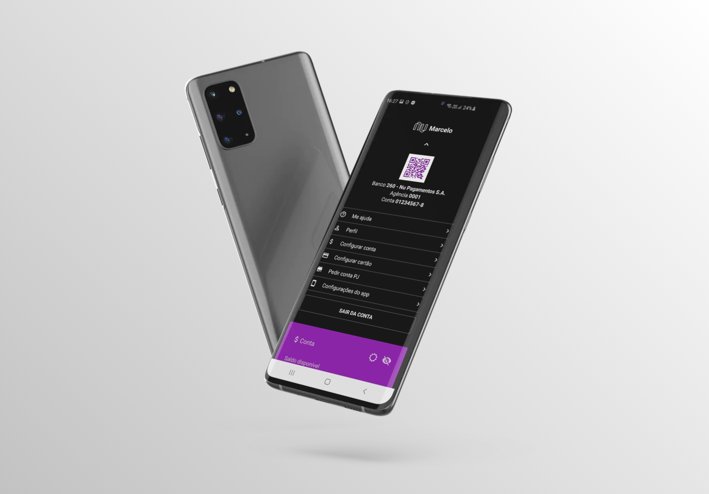

## :camel: react-native-nubank-typescript
Nubank interface clone built with React Native and Typescript, with dark mode support.

### :rabbit2: My LinkedIn
<a href="https://www.linkedin.com/in/marcelo-dornelas-b4303514a/">Click here</a>

### :tv: View this project on Youtube
<a href="https://www.youtube.com/watch?v=M1wmdxh75fg">Click here</a>

### :camera: Sample
